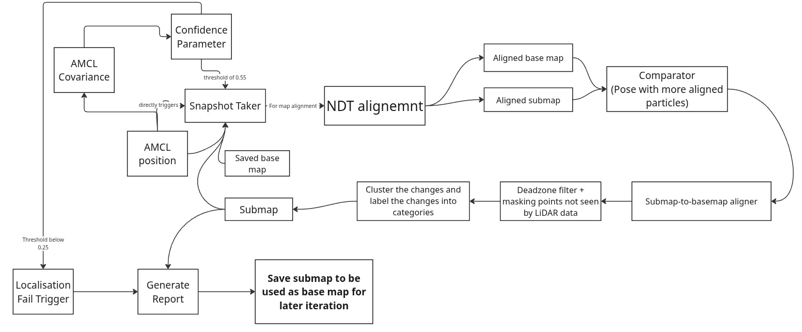

# Documentation of the Project for Lifelong Mapping

## Overview

This project aims to develop a change detection system for lifelong mapping. The primary objective is to identify changes between a previously saved map and the robot's current observations.

The system should be capable of detecting:

*   Newly introduced objects that were not present in the original map.
*   Objects that have been removed from the environment.

To achieve this, several intermediate processing stages are implemented to evaluate localization confidence, align costmaps, filter deadzones, and classify environmental changes.

---

## Documentation Structure

The detailed description of all published topics and their purpose can be found in:

*   [Topics Documentation](docs/topics.md)
*   [Nav2 Params Documentation](docs/params.md)
*   [Confidence Parameter](docs/confidence.md)

---

## Project Workflow (Pipeline)

The lifelong mapping pipeline operates through a continuous loop of localization tracking, scan matching, and map updating. The overall workflow is as follows:

1.  **Localization Monitoring:** The system continuously monitors AMCL position and AMCL Covariance to calculate a Localization Confidence Parameter. 
    *   *Failsafe:* If the AMCL covariance drops below a threshold of `0.25`, a **Localisation Fail Trigger** fires, immediately initiating the Report Generation process.
2.  **Snapshot Triggering:** If the confidence parameter meets the threshold of `0.55`, it directly triggers the **Snapshot Taker**.
3.  **NDT Alignment:** The Snapshot Taker extracts the current **Submap** and the **Saved base map**, passing them into the **NDT alignment** module for map alignment.
4.  **Comparator Assessment:** The NDT process outputs an *Aligned base map* and an *Aligned submap*. These are fed into a **Comparator**, which evaluates and selects the pose with the higher number of aligned particles.
5.  **Submap-to-Basemap Alignment:** The chosen pose is processed through a Submap-to-basemap aligner to lock in the regional transformations.
6.  **Filtering & Masking:** The aligned data goes through a **Deadzone filter** and masks out points that were not actively seen by the LiDAR data.
7.  **Clustering & Categorization:** The isolated changes are clustered together and labeled into specific categories (e.g., added or removed objects).
8.  **Reporting & Iteration:** The categorized changes update the active **Submap**. The system then generates a final report and saves the updated submap to be used as the new base map for later iterations.

---

## Purpose

The final goal of this project is to provide a reliable mechanism for long-term environment monitoring, enabling robots to identify and track environmental changes over time while operating in previously mapped spaces.