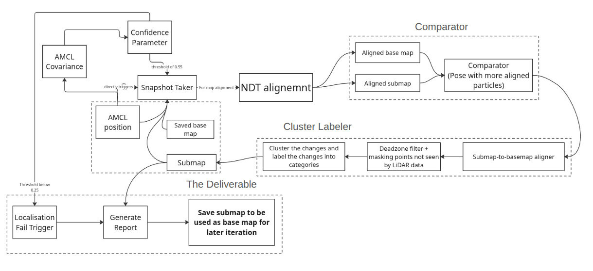
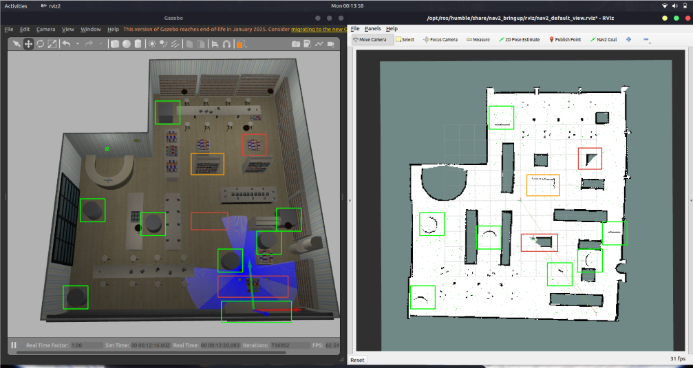

## Lifelong Mapping Solution

This system is a ROS2-based detection pipeline designed to enable autonomous robots to identify environmental changes and "save" them on a new custom map. Instead of failing when an environment drifts from its initial state, this system empowers the robot to determine whether a detected change requires the room to be re-scanned and the map updated, or if it is merely transient and can be safely ignored.

By adapting 3D point clouds into a 2D framework, the pipeline extracts the core concepts of "positive" (added objects) and "negative" (removed objects) changes via base map versus dynamic submap comparisons.

---

## Pipeline Architecture



## Demo Video
https://github.com/user-attachments/assets/72ceccce-1e5d-4b6f-b06f-1420b19f13ad

## Result

---

## 1. Launch the Simulation

Launch the Gazebo simulation. You can use any environment you want, but if you want to use the one present in the model, run:

```bash
ros2 launch submap_map_ap bookstore_turtlebot.launch.py

```

*Note: This script launches the AWS Bookstore world in Gazebo, opens the Gazebo GUI (`gzclient`), and spawns the Turtlebot3 robot into the environment.*

---

## 2. Create a SLAM Map

Start SLAM Toolbox:

```bash
ros2 launch slam_toolbox online_async_launch.py 

```

Drive the robot around the environment to build a map.

### Save the Map

```bash
ros2 run nav2_map_server map_saver_cli -f my_map_name

```

This will generate:

* `my_map_name.yaml`
* `my_map_name.pgm`

---

## 3. Update Configuration File

Before running the rest of the pipeline, you must configure the system via the centralized `config/submap_map.yaml` file. This file dictates how the entire mapping, change detection, and recovery pipeline behaves.

### Key Paths to Update

You **must** update these paths to match your local machine's directories before launching:

* **`map_path`** (under global `/**`): Set this to the absolute directory path of your newly saved `.yaml` map file.
* **`save_dir_path`** (under `ndt_visualizer_node`): Set this to your desired directory for saving snapshot images (useful if `ndt_visualise` is set to `True`).
* **`Report_Save_Location`** (under both `bot_report_generator` & `recovery_manager_node`): Define the directory where the system should save (and subsequently load) the updated map reports.

### Important Parameters to Know

While the defaults are tuned for the pipeline, here are a few critical settings you might want to adjust depending on your environment:

* **Global Parameters (`/**`)**: Contains `use_sim_time` (keep this `true` for Gazebo simulations) and `deadzone_of_bot` (determines the radius around the robot where changes are ignored to prevent detecting the robot itself).
* **Snapshot Triggers (`snapshot_trigger_node`)**: Controls exactly *when* the robot captures a local submap based on distance traveled (`distance_threshold`), rotation (`angle_threshold`), and minimum AMCL reliability (`confidence_threshold`).
* **NDT Aligner (`ndt_node`)**: Houses the sanity check thresholds (e.g., `sanity_dist_threshold`, `sanity_yaw_threshold`) to ensure the scan alignments make physical sense before the system trusts them.
* **Fail-Safe Trigger (`bot_position_tracker`)**: The `confidence_threshold_lost` parameter dictates the minimum allowable AMCL confidence (defaulted to `0.25`); if it drops below this, the system declares the robot "lost" and triggers the recovery sequence.

---

## 4. Bring Up the Navigation Stack & System Nodes

Once configured, launch the remaining pipeline using the provided launch files in the following order:

### A. Core Navigation & Costmaps

```bash
ros2 launch submap_map_ap bringup_all.launch.py

```

**What this does:**
Parses your `submap_map.yaml` file and automatically launches the Nav2 Localization and Navigation stacks. It also fires up RViz2 for visualization, generates local costmaps, and starts the AMCL Confidence node to track localization health.

### B. Map Analytics & Report Generation

```bash
ros2 launch submap_map_ap map_updater.launch.py

```

**What this does:**
Uses the `nav2_lifecycle_manager` to safely boot up analytics nodes. It starts the occupied cell publisher (map analytics), the bot position tracking system, and the report generator that determines what gets permanently written to the map.

### C. NDT Alignment & Change Detection

```bash
ros2 launch submap_map_ap ndt_launch.launch.py

```

**What this does:**
This is the heart of the change detection pipeline. It brings up the snapshot tracker/publisher, the NDT aligner, the dynamic submap generator, and the cluster creator. These nodes work together to grab local snapshots of the environment, align them against the base map, and categorize structural changes.

---

## 5. Autonomous System Recovery (Background Node)

The system includes a dedicated fail-safe node to handle severe localization failures.

```bash
ros2 run submap_map_ap recovery_manager.py

```

**What this does:**
Running this node monitors the `/is_bot_lost` topic. If the robot's localization drifts beyond acceptable thresholds, this node pauses the system, scans your designated save directory for the most recently updated map, and automatically loads it into Nav2. It will clear stale costmaps, reinitialize AMCL, and safely reboot the lifecycle nodes so the robot can resume operations without manual intervention.
